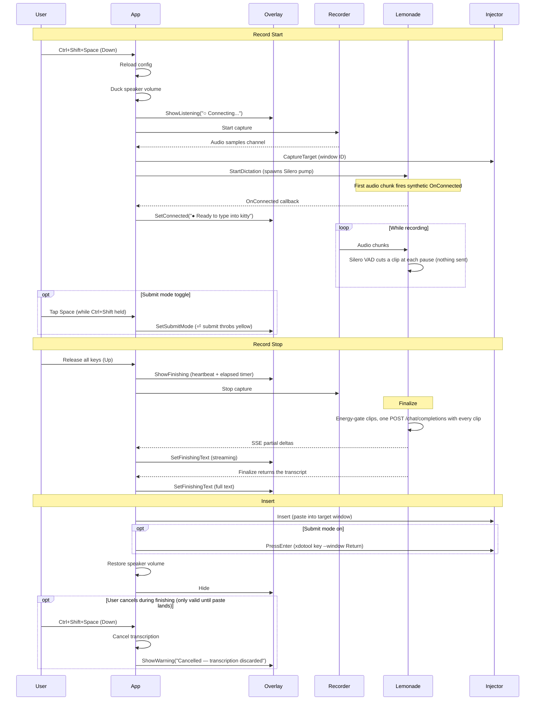

# Runtime Flow

This page is the detailed path for one dictation session.

## Sequence Diagram

## Startup

When `vocis serve` runs:

1. [`cmd/vocis/serve.go`](/home/fred/git/vtt/cmd/vocis/serve.go) starts a session log and loads config.
2. `serve.go` creates the platform implementations (overlay, injector, hotkey registrar). The overlay is X11-only: if `x11.NewOverlay()` fails — a Wayland session with no XWayland server, or any other X connection error — `serve.go` logs a warning and substitutes `app.NoopOverlay`, so dictation still runs end to end without visual feedback. The chosen backend is logged as `overlay backend: x11` or `overlay backend: none`.
3. `serve.go` injects them into [`internal/app/app.go`](/home/fred/git/vtt/internal/app/app.go) via `app.New(cfg, deps)`.
4. `app.Run()` registers the hotkey (with fallback candidates) and enters the event loop.

## Config Reload

`vocis serve` re-reads `~/.config/vocis/config.yaml` at the start of every dictation, just before the mic opens (`App.reloadConfig` in `internal/app/app.go`). The reload is partial — only the sections used by the per-dictation pipeline are refreshed; everything wired up at process start stays pinned.

**Refreshed on every hotkey press (no restart needed):**

- `transcription.*` — base_url, model, prompt, prompt_hint, language, hallucination_filters, min_chunk_peak, min_chunk_rms, ctx_size, silero.onnxruntime_library. The transcribe `Client` is rebuilt so a new endpoint/model takes effect.
- `recording.device`.
- `log_window_title`.

**Pinned at `vocis serve` startup (require restart to change):**

- `hotkey`, `hotkey_mode` — registered with the OS once.
- `insertion.*` — paste keys, terminal_classes, auto_submit, kitty_remote_control. The `Injector` is constructed once in `cmd/vocis/serve.go`.
- `telemetry.*` — exporter is initialized once.
- `speak.*` — only consulted by the separate `vocis speak` command, not by `serve`.

**Tuning constants pinned as Go consts (rebuild required to change):**

The bulk of the previous YAML surface — overlay dimensions/copy, the
chat-audio protocol knobs (clip cap, stream,
context_mode, batch_prompt, batch_max_audio_seconds,
request_timeout_seconds), Silero hysteresis (silence_ms / speech_ms /
min_utterance_ms in both `transcription.silero.*` and `recall.*`), recorder shape (sample_rate=16000
and channels=1 are required by Silero / chat-audio anyway,
duck_volume, max_duration_seconds, backend) — all of those live as
package-level consts at the consumer site now. The motivation was a
config-surface cull: ~60 knobs had defaults that were never tuned in
practice. To change one, edit the const and rebuild.

**Recall daemon (`vocis recall`) is a separate long-lived process that does NOT reload.** Every field under `recall.*` plus the `transcription.*` block the daemon copies at startup are pinned for the daemon's lifetime. Restart with `pkill -f 'vocis recall' && vocis recall &` after editing. The short-lived `recall pick`/`last`/`delete` subcommands load fresh config on each invocation.

## Record Start

When the hotkey starts dictation:

1. Config is reloaded from disk.
2. Audio ducking lowers the default speaker volume (level pinned at `audio.DefaultDuckVolume`).
3. [`internal/platform/x11/overlay.go`](/home/fred/git/vtt/internal/platform/x11/overlay.go) shows the overlay immediately with "○ Connecting..." status.
4. The overlay repositions to the monitor where the mouse pointer is.
5. [`internal/recorder/recorder.go`](/home/fred/git/vtt/internal/recorder/recorder.go) starts local microphone capture immediately.
6. The injector captures the active target window after capture has already started so focus can be restored later.
7. [`internal/transcribe/chat_audio.go`](/home/fred/git/vtt/internal/transcribe/chat_audio.go) starts a `chatAudioSession`.
8. The session spawns one goroutine: an audio pump that runs Silero VAD on incoming samples and cuts a clip at each `speech_stopped` (or at the 28 s per-clip cap). Nothing is sent while the hotkey is held.
9. The synthetic "connected" callback fires on the first audio chunk so the overlay can flip from "Connecting..." to "Ready to type into {window}".

### Submit Mode

While recording with Ctrl+Shift held, tapping Space toggles submit mode. The hotkey system emits a `Tap` event (distinct from `Down`/`Up`) when Space is re-pressed while already in the "down" state. Auto-repeat key events are filtered out — only genuine release+press cycles trigger the toggle.

The overlay shows a throbbing yellow "⏎ submit" indicator when submit mode is enabled. On release, the text is pasted and `xdotool key --window <id> Return` is sent to the target window.

## Record Stop

When the hotkey stops dictation:

1. [`internal/app/app.go`](/home/fred/git/vtt/internal/app/app.go) stops local recording.
2. The overlay switches to the "Finishing" state with a heartbeat wave animation, showing the accumulated text and an elapsed-time counter that ticks up from 0 (e.g. `Wrapping up... (2.3s)`). There is no outer deadline on the finalize call — the counter runs until the transcription completes or the user cancels.
3. The user can press the hotkey during this state to cancel the in-flight transcription. The overlay shows "Cancelled — transcription discarded". The dismissable window ends as soon as the paste lands (and submit Enter, if any, has fired): from that point onward, a hotkey press starts a fresh dictation rather than dismissing the just-completed one. This matters because the success-overlay fade-out takes ~320ms — without an explicit "delivery completed" marker, an eager user pressing the hotkey during the fade would otherwise hit the cancel path and see a stray "Cancelled" warning even though the transcript already landed.
4. [`internal/transcribe/chat_audio.go`](/home/fred/git/vtt/internal/transcribe/chat_audio.go) finalizes the `chatAudioSession`:
   - `Finalize` waits for the audio pump to hand over the clips, drops silent ones (energy gate; the RMS arm is skipped when Silero saw speech), and sends every remaining clip as its own `input_audio` part in ONE `/chat/completions` POST. SSE deltas stream into the overlay while the model answers. The reply is the transcript.
5. The overlay updates to show the complete transcription text.
6. The transcript returned by `Finalize` is inserted as a single paste.
7. If submit mode was toggled on, Enter is pressed on the target window.
8. Audio ducking restores the speaker volume.

## Insert

After transcription completes:

1. [`internal/platform/x11/injector.go`](/home/fred/git/vtt/internal/platform/x11/injector.go) restores focus to the original window.
2. The transcript is inserted via clipboard paste or direct typing depending on config.
3. Terminal windows use the configured terminal paste shortcut.
4. If submit mode is on, `xdotool key --window <id> Return` is sent to the target window.
5. The overlay hides.

## Clip Cutting

Client-side Silero VAD decides clip boundaries. While the hotkey is held:

1. The audio pump feeds 16 kHz mono PCM through Silero. A `speech_stopped` transition cuts a clip; a long monologue without a pause is cut at the 28 s per-clip cap (Gemma's 30 s audio limit with margin).
2. Clips stay in memory. No request is made until release.
3. On release, all clips travel in one request, labelled `[clip N]:` in spoken order, with a system-prompt framing that asks for one continuous transcript.
4. [`internal/app/app.go`](/home/fred/git/vtt/internal/app/app.go) renders SSE partials into the Finishing view and pastes the text `Finalize` returns.

Nothing is typed into the target window during recording. This avoids corrupting the X11 keymap state with `xdotool keyup` while the user is still holding the hotkey.

## Level Meter

The Listening bars follow the mic peak on a dB scale: -40 dB is the floor, 0 dB is full height, with a 220 ms decay. Raw amplitude would leave normal speech (around 0.05 of full scale) at 5% height and look dead.

## Overlay Animations

The overlay uses several animation modes:

- **First appearance** (e.g., hotkey pressed when overlay is hidden): slides down while fading in over 320ms. Opacity ramps linearly; slide position uses ease-out cubic.
- **State transitions** (e.g., Listening → Finishing): true pixel-level crossfade over 80ms. The previous frame is captured, the new state is applied, and the two frames are alpha-blended in software.
- **Final hide** (auto-hide timer or manual dismiss): slides up while fading out over 320ms with ease-in cubic for the slide.
- **Heartbeat wave** (Finishing state): bars pulse with a lub-dub rhythm while transcription is being finalized.
- **Submit hint** (Listening state with submit mode): throbbing yellow "⏎ submit" text next to the title suffix, driven by the wave phase.

## Overlay Positioning

The overlay centers on whichever monitor the mouse pointer is on, detected via Xinerama + `xproto.QueryPointer`. Position is recalculated each time the overlay appears.

## Overlay Text Configuration

Overlay strings live as Go consts in [`internal/ui/overlay_consts.go`](/home/fred/git/vtt/internal/ui/overlay_consts.go). Templates use named `{placeholders}` (e.g., `{window}`, `{shortcut}`, `{attempt}`, `{max}`, `{model}`) expanded at runtime via `config.ExpandTemplate`. Missing placeholders are left as-is. The previous `overlay.*` YAML block was retired — nobody changed the defaults in practice.

## Tracing

When telemetry is enabled, the following OpenTelemetry spans are emitted per dictation session:

- `vocis.dictation` — root span covering the full session lifecycle
  - Attributes: `hotkey.backend` (`x11` or `gnome-extension`), `target.window_id`, `target.window_class`, `hotkey_mode`, `submit_mode`, `recording.bytes`, `recording.duration`, `transcription.total_chars`
  - Events (overlay state transitions):
    - `overlay.connected` — first audio chunk reached the transcription session
    - `overlay.submit_mode` (`enabled`) — user toggled submit mode
    - `overlay.finishing` (`auto_stop`) — recording stopped, entering finish phase
    - `overlay.warning` (`reason`) — warning shown (e.g. `target_gone`)
    - `overlay.success` — transcription inserted successfully
  - Child spans:
    - `vocis.capture_target` — identify the focused window. `capture.source` = `xdotool` or `extension`; the extension path nests `vocis.gnome.get_focused_window` for the D-Bus call.
    - `vocis.recorder.start` — PulseAudio client init and stream creation
    - `vocis.recording.active` — the user speaking (from dictation start to release)
    - `vocis.transcribe.chat_audio.chunk` — the single release-time `/chat/completions` POST. Attributes include `chunk.clip_count`, `chunk.duration_ms`, `chunk.wav_bytes`, `chunk.request_bytes`, and the response text.
    - `vocis.recorder.stop` — stream stop and resource cleanup
    - `vocis.inject` — text insertion into the target window
      - `vocis.inject.focus` — window activate and modifier key release
      - `vocis.inject.paste` or `vocis.inject.type` — clipboard paste or xdotool type

## Short Recordings

Very short recordings are treated as a silent cancel:

- [`internal/recorder/recorder.go`](/home/fred/git/vtt/internal/recorder/recorder.go) returns `ErrRecordingTooShort`
- [`internal/app/app.go`](/home/fred/git/vtt/internal/app/app.go) catches that and hides the overlay
- no user-facing error is shown for that case

## Error Handling

Errors are translated to user-friendly messages in the overlay:

- Network timeouts → "Could not connect to Lemonade (network timeout)"
- Context deadline → "Timed out waiting for transcription"
- Empty audio buffer → "No speech detected" (yellow warning, not red error)
- Cancellation → "Cancelled — transcription discarded" (yellow warning)

See [`debugging.md`](/home/fred/git/vtt/docs/debugging.md) for logs, tracing (Jaeger API), and diagnostic tips.

## Verification Standard

This repo intentionally uses a high bar before calling work done:

- Test-Driven Development (TDD) for bug fixes: write a failing test first, then fix
- unit tests where they make sense
- successful build
- local runtime verification for behavior changes whenever feasible

That rule is summarized in [`AGENTS.md`](/home/fred/git/vtt/AGENTS.md).
