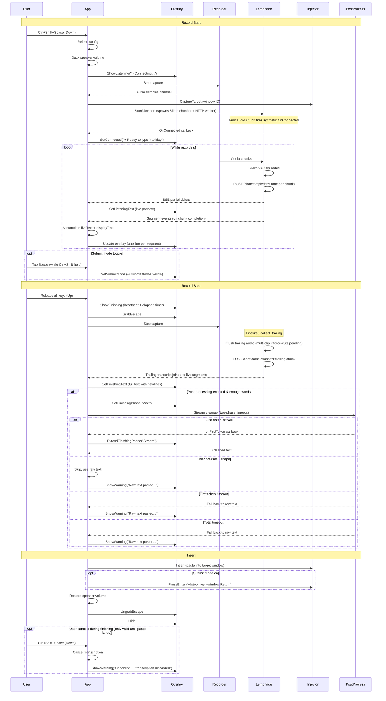

# Runtime Flow

This page is the detailed path for one dictation session.

## Sequence Diagram

## Startup

When `vocis serve` runs:

1. [`cmd/vocis/serve.go`](/home/fred/git/vtt/cmd/vocis/serve.go) starts a session log and loads config.
2. `serve.go` creates the X11 platform implementations (overlay, injector, hotkey registrar).
3. `serve.go` injects them into [`internal/app/app.go`](/home/fred/git/vtt/internal/app/app.go) via `app.New(cfg, deps)`.
4. `app.Run()` registers the hotkey (with fallback candidates) and enters the event loop.

## Config Reload

`vocis serve` re-reads `~/.config/vocis/config.yaml` at the start of every dictation, just before the mic opens (`App.reloadConfig` in `internal/app/app.go`). The reload is partial — only the sections used by the per-dictation pipeline are refreshed; everything wired up at process start stays pinned.

**Refreshed on every hotkey press (no restart needed):**

- `transcription.*` — base_url, model, prompt, prompt_hint, language, hallucination_filters, min_chunk_peak, min_chunk_rms, ctx_size, batch_until_release, continuation_rebatch, rebatch_max_seconds, silero.onnxruntime_library. The transcribe `Client` is rebuilt so a new endpoint/model takes effect.
- `recording.device`.
- `postprocess.*` — enabled, model, prompt.
- `log_window_title`.

**Pinned at `vocis serve` startup (require restart to change):**

- `hotkey`, `hotkey_mode` — registered with the OS once.
- `insertion.*` — paste keys, terminal_classes, auto_submit, kitty_remote_control. The `Injector` is constructed once in `cmd/vocis/serve.go`.
- `telemetry.*` — exporter is initialized once.
- `speak.*` — only consulted by the separate `vocis speak` command, not by `serve`.

**Tuning constants pinned as Go consts (rebuild required to change):**

The bulk of the previous YAML surface — overlay dimensions/copy, the
chat-audio protocol knobs (chunk_max_seconds, history_turns, stream,
context_mode, batch_prompt, batch_max_audio_seconds,
request_timeout_seconds), Silero hysteresis (silence_ms / speech_ms /
min_utterance_ms in both `transcription.silero.*` and `recall.*`),
postprocess timing (min_word_count, first_token_timeout_seconds,
total_timeout_seconds, temperature), recorder shape (sample_rate=16000
and channels=1 are required by Silero / chat-audio anyway,
duck_volume, max_duration_seconds, backend) — all of those live as
package-level consts at the consumer site now. The motivation was a
config-surface cull: ~60 knobs had defaults that were never tuned in
practice. To change one, edit the const and rebuild.

**Recall daemon (`vocis recall`) is a separate long-lived process that does NOT reload.** Every field under `recall.*` plus the `transcription.*` and `postprocess.*` blocks the daemon copies at startup are pinned for the daemon's lifetime. Restart with `pkill -f 'vocis recall' && vocis recall &` after editing. The short-lived `recall pick`/`last`/`delete` subcommands load fresh config on each invocation.

## Record Start

When the hotkey starts dictation:

1. Config is reloaded from disk.
2. Audio ducking lowers the default speaker volume (level pinned at `audio.DefaultDuckVolume`).
3. [`internal/platform/x11/overlay.go`](/home/fred/git/vtt/internal/platform/x11/overlay.go) shows the overlay immediately with "○ Connecting..." status.
4. The overlay repositions to the monitor where the mouse pointer is.
5. [`internal/recorder/recorder.go`](/home/fred/git/vtt/internal/recorder/recorder.go) starts local microphone capture immediately.
6. The injector captures the active target window after capture has already started so focus can be restored later.
7. [`internal/transcribe/chat_audio.go`](/home/fred/git/vtt/internal/transcribe/chat_audio.go) starts a `chatAudioSession`.
8. The session spawns two goroutines: an audio pump that runs Silero VAD on incoming samples, and an HTTP worker that serializes one `/chat/completions` POST per VAD-bounded (or chunk_max_seconds-bounded) chunk.
9. The synthetic "connected" callback fires on the first audio chunk so the overlay can flip from "Connecting..." to "Ready to type into {window}".

### Submit Mode

While recording with Ctrl+Shift held, tapping Space toggles submit mode. The hotkey system emits a `Tap` event (distinct from `Down`/`Up`) when Space is re-pressed while already in the "down" state. Auto-repeat key events are filtered out — only genuine release+press cycles trigger the toggle.

The overlay shows a throbbing yellow "⏎ submit" indicator when submit mode is enabled. On release, the text is pasted and `xdotool key --window <id> Return` is sent to the target window.

## Record Stop

When the hotkey stops dictation:

1. [`internal/app/app.go`](/home/fred/git/vtt/internal/app/app.go) stops local recording.
2. The Escape key is temporarily grabbed for the finishing state.
3. The overlay switches to the "Finishing" state with a heartbeat wave animation, showing the accumulated text and an elapsed-time counter that ticks up from 0 (e.g. `Wrapping up... (2.3s)`). There is no outer deadline on the finalize call — the counter runs until the transcription completes or the user cancels.
4. The user can press the hotkey during this state to cancel the in-flight transcription. The overlay shows "Cancelled — transcription discarded". The dismissable window ends as soon as the paste lands (and submit Enter, if any, has fired): from that point onward, a hotkey press starts a fresh dictation rather than dismissing the just-completed one. This matters because the success-overlay fade-out takes ~320ms — without an explicit "delivery completed" marker, an eager user pressing the hotkey during the fade would otherwise hit the cancel path and see a stray "Cancelled" warning even though the transcript already landed.
5. [`internal/transcribe/chat_audio.go`](/home/fred/git/vtt/internal/transcribe/chat_audio.go) finalizes the `chatAudioSession`:
   - `Finalize` flips the session out of live-segment mode, waits for the audio pump to drain, and the worker flushes a trailing chunk that POSTs to `/chat/completions` one last time (multi-clip when force-cut segments are pending).
   - Trailing transcripts are joined to the already-emitted live segments. Continuation rebatch first emits a `begin_replace` event (live phase only) so the overlay can retract — and animate the deletion of — the prior segment in parallel with the rebatched POST; a `replace_segment` follows on success with the unified two-clip transcript, or a `cancel_replace` restores the prior segment if the POST fails.
6. The overlay updates to show the complete transcription text (segments + trailing) with newlines preserved. The finished "Wrapping up" phase is pushed onto a completed-phases list with its elapsed duration (e.g. `Wrapping up — done (2.3s)`) so the user can see how long finalization actually took.
7. If post-processing is enabled and the text has enough words (`postprocess.min_word_count`):
   - The overlay shows a new `Wait...` phase counting up from 0. Internal first-token / total timeouts still apply inside the post-processing call — they are enforced but not displayed.
   - When the first token arrives, the phase extends in place to `Wait · Stream... (elapsed)`, again counting up from 0 for the streaming portion.
   - If no first token arrives within the first-token timeout, raw text is pasted immediately (the model is likely stuck).
   - Pressing Escape during either phase skips post-processing and pastes raw text.
   - If the stream errors or returns empty, raw text is pasted with a yellow warning overlay.
8. The accumulated segment text plus any trailing transcript is combined and inserted as a single paste.
9. If submit mode was toggled on, Enter is pressed on the target window.
10. Audio ducking restores the speaker volume.
11. The Escape key grab is released.

## Insert

After transcription completes:

1. [`internal/platform/x11/injector.go`](/home/fred/git/vtt/internal/platform/x11/injector.go) restores focus to the original window.
2. The transcript is inserted via clipboard paste or direct typing depending on config.
3. Terminal windows use the configured terminal paste shortcut.
4. If submit mode is on, `xdotool key --window <id> Return` is sent to the target window.
5. The overlay hides.

## Segmented Streaming

Client-side Silero VAD decides chunk boundaries. While the hotkey is held:

1. The chat-audio audio pump feeds 16 kHz mono PCM through Silero. A `speech_stopped` transition closes a chunk; long monologues without a pause force-cut at `chunk_max_seconds` and accumulate into a multi-clip batch.
2. The HTTP worker POSTs each chunk to `/chat/completions` and emits SSE-derived partial deltas plus a segment event when the response completes.
3. [`internal/app/app.go`](/home/fred/git/vtt/internal/app/app.go) accumulates segment text in `recordingState.liveText` (for pasting) and `recordingState.displayText` (for the overlay, with newlines between segments).
4. The overlay displays each segment on a separate line, growing vertically as text accumulates. Partial transcription text is prepended with the accumulated segments so previously completed text stays visible.
5. On release, the trailing chunk POSTs one last time, and the joined text is pasted into the target window as a single insertion.

Segments are never typed into the target window during recording. This avoids corrupting the X11 keymap state with `xdotool keyup` while the user is still holding the hotkey.

## Overlay Animations

The overlay uses several animation modes:

- **First appearance** (e.g., hotkey pressed when overlay is hidden): slides down while fading in over 320ms. Opacity ramps linearly; slide position uses ease-out cubic.
- **State transitions** (e.g., Listening → Finishing): true pixel-level crossfade over 80ms. The previous frame is captured, the new state is applied, and the two frames are alpha-blended in software.
- **Final hide** (auto-hide timer or manual dismiss): slides up while fading out over 320ms with ease-in cubic for the slide.
- **Heartbeat wave** (Finishing state): bars pulse with a lub-dub rhythm while transcription is being finalized.
- **Submit hint** (Listening state with submit mode): throbbing yellow "⏎ submit" text next to the title suffix, driven by the wave phase.

## Overlay Positioning

The overlay centers on whichever monitor the mouse pointer is on, detected via Xinerama + `xproto.QueryPointer`. Position is recalculated each time the overlay appears.

## Overlay Text Configuration

Overlay strings live as Go consts in [`internal/ui/overlay_consts.go`](/home/fred/git/vtt/internal/ui/overlay_consts.go). Templates use named `{placeholders}` (e.g., `{window}`, `{shortcut}`, `{attempt}`, `{max}`, `{model}`) expanded at runtime via `config.ExpandTemplate`. Missing placeholders are left as-is. The previous `overlay.*` YAML block was retired — nobody changed the defaults in practice.

## Tracing

When telemetry is enabled, the following OpenTelemetry spans are emitted per dictation session:

- `vocis.dictation` — root span covering the full session lifecycle
  - Attributes: `hotkey.backend` (`x11` or `gnome-extension`), `target.window_id`, `target.window_class`, `hotkey_mode`, `submit_mode`, `recording.bytes`, `recording.duration`, `transcription.total_chars`, `transcription.live_chars`, `transcription.trailing_chars`
  - Events (overlay state transitions):
    - `overlay.connecting` (`attempt`, `max`) — WebSocket connection attempt
    - `overlay.connected` — connection established
    - `overlay.submit_mode` (`enabled`) — user toggled submit mode
    - `overlay.finishing` (`auto_stop`) — recording stopped, entering finish phase
    - `overlay.phase.wait` — post-processing wait phase started
    - `overlay.warning` (`reason`) — warning shown (e.g. `postprocess_skipped`)
    - `overlay.success` — transcription inserted successfully
  - Child spans:
    - `vocis.capture_target` — identify the focused window. `capture.source` = `xdotool` or `extension`; the extension path nests `vocis.gnome.get_focused_window` for the D-Bus call.
    - `vocis.recorder.start` — PulseAudio client init and stream creation
    - `vocis.recording.active` — the user speaking (from dictation start to release)
    - `vocis.transcribe.chat_audio.chunk` — one span per VAD-bounded audio chunk POSTed to `/chat/completions`. Attributes include `chunk.duration_ms`, `chunk.wav_bytes`, `chunk.history_turns`, `chunk.request_bytes`, and the response text. The trailing transcript from `Finalize` is collected under `vocis.transcribe.chat_audio.collect_trailing`.
    - `vocis.recorder.stop` — stream stop and resource cleanup
    - `vocis.postprocess` — LLM cleanup with two-phase streaming timeout
      - Attributes: `input.length`, `model`, `output.length`, `skipped`, `postprocess.first_token_timeout_sec`, `postprocess.total_timeout_sec`, `postprocess.error`
      - Events: `postprocess.streaming_request_sent`, `postprocess.first_token_received` (`elapsed`), `postprocess.first_token_timeout` (`timeout`), `postprocess.streaming_complete` (`elapsed`), `postprocess.empty_response`, `postprocess.cancelled_by_user`
    - `vocis.inject` — text insertion into the target window
      - `vocis.inject.focus` — window activate and modifier key release
      - `vocis.inject.paste` or `vocis.inject.type` — clipboard paste or xdotool type

## Short Recordings

Very short recordings are treated as a silent cancel:

- [`internal/recorder/recorder.go`](/home/fred/git/vtt/internal/recorder/recorder.go) returns `ErrRecordingTooShort`
- [`internal/app/app.go`](/home/fred/git/vtt/internal/app/app.go) catches that and hides the overlay
- no user-facing error is shown for that case

## Error Handling

Errors are translated to user-friendly messages in the overlay:

- Network timeouts → "Could not connect to Lemonade (network timeout)"
- Context deadline → "Timed out waiting for transcription"
- Empty audio buffer → "No speech detected" (yellow warning, not red error)
- Post-processing failure → "Raw text pasted — cleanup was skipped" (yellow warning)
- Cancellation → "Cancelled — transcription discarded" (yellow warning)

See [`debugging.md`](/home/fred/git/vtt/docs/debugging.md) for logs, tracing (Jaeger API), and diagnostic tips.

## Verification Standard

This repo intentionally uses a high bar before calling work done:

- Test-Driven Development (TDD) for bug fixes: write a failing test first, then fix
- unit tests where they make sense
- successful build
- local runtime verification for behavior changes whenever feasible

That rule is summarized in [`AGENTS.md`](/home/fred/git/vtt/AGENTS.md).
